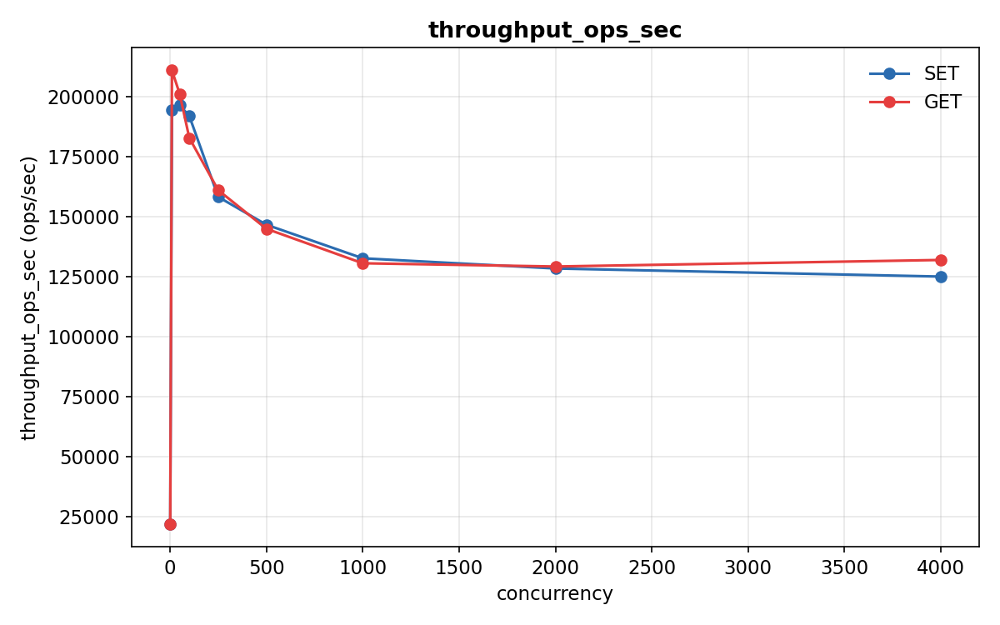
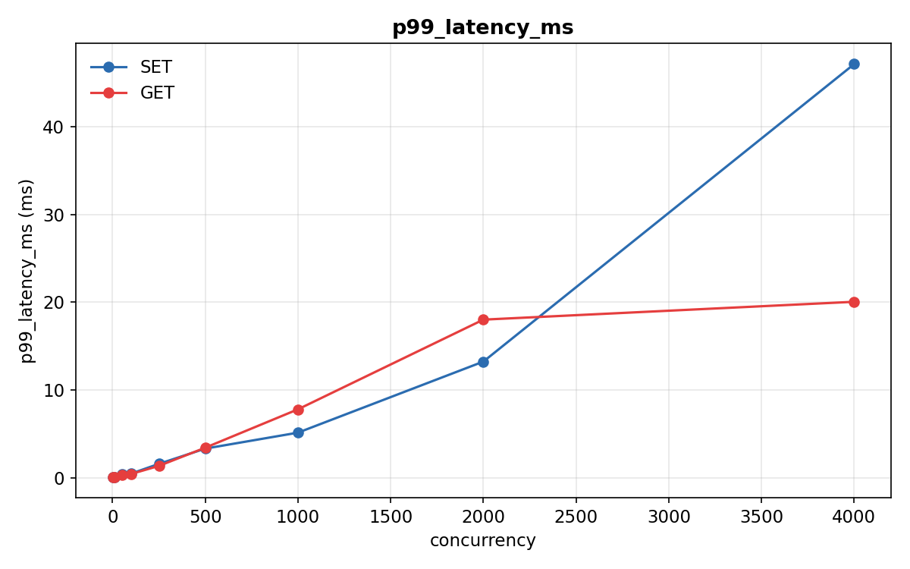
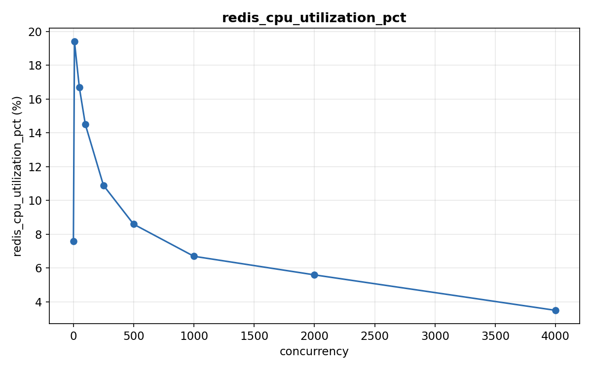
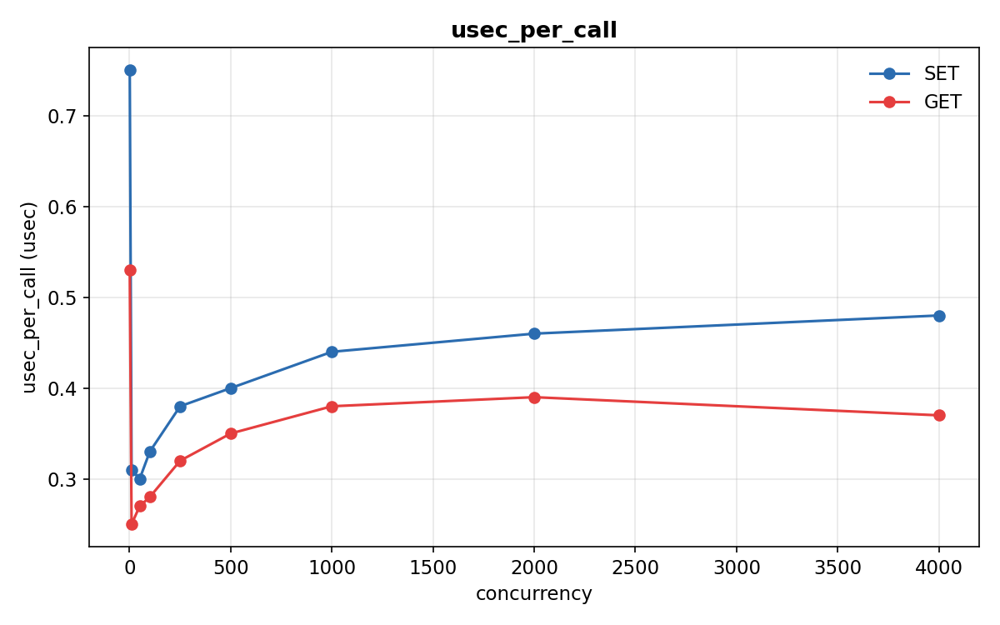

# Redis에 요청을 얼마나 넣으면 터질까?

- 날짜: 2026-07-15
- 템플릿: redis-blocking-threshold
- 태그: redis, performance, docker

## 안건
Redis 단일 인스턴스는 초당 몇 건의 SET/GET 요청부터 P99 레이턴시가 급격히(10배
이상) 튀며 이벤트 루프가 포화 상태에 진입하는가?

## 요약
동시 연결 250개부터 심상치 않다. concurrency 1일 때 SET P99는 0.071ms인데,
250에서 1.439ms로 약 20배 뛰어 "baseline 10배" 기준을 넘겼다. 근데 원래
가설("이벤트 루프가 CPU 포화돼서 그렇다")은 틀렸다 — redis-server의 CPU
사용률은 임계점(250)에서도 10.9%밖에 안 됐고, concurrency가 늘수록 오히려
더 떨어졌다(4000에서 3.5%). 명령 하나 처리하는 데 걸리는 시간(usec_per_call)도
0.3~0.5마이크로초로 끝까지 거의 안 변했다. 즉 레이턴시가 튀는 건 Redis가
바빠서가 아니라 다른 어딘가(연결/큐잉 레벨)에서 병목이 생기는 거다.

## 가설
Redis는 단일 스레드 이벤트 루프이므로, concurrency가 baseline(최소 concurrency)
대비 P99 10배 임계값을 넘는 지점부터 이벤트 루프가 포화되어 처리량은 정체되고
지연시간이 급증할 것이다.

## 구성
- `redis:7-alpine`, `--maxmemory-policy noeviction`, `cpus: 2` 제한 (docker compose)
- `runner`: 공용 이미지(`ds-labs/runner:1.0.0`)를 `redis-tools`로 확장
- 부하 도구: Debian `redis-tools` 패키지의 `redis-benchmark`

## 방법
`redis-benchmark -h redis -t set,get -n 100000 -c <concurrency> --csv`를
`concurrency_sweep: [1, 10, 50, 100, 250, 500, 1000, 2000, 4000]` 각 값에 대해
순차 실행하고, `--csv` 출력의 `rps`/`p99_latency_ms` 컬럼을 수집했다.
`baseline_p99`(concurrency=1의 SET P99) 대비 `sla_multiplier`(10배)를 처음
넘는 concurrency를 임계값으로 정의했다.

가설을 직접 검증하려고 계측을 추가했다: 각 concurrency 스텝 전후로
`redis-cli INFO cpu`의 `used_cpu_user`(누적 CPU 시간) 델타를 스텝 wall-clock
시간으로 나눠 "그 구간에 redis-server가 CPU를 얼마나 썼는지"를 구했고,
스텝마다 `CONFIG RESETSTAT` 후 `INFO commandstats`의 `usec_per_call`로
"명령 하나 처리하는 데 서버가 실제로 쓴 시간"도 같이 쟀다. 클라이언트가
보는 P99(대기 시간 포함)와 서버가 보는 처리 시간을 나란히 놓고 비교하는 게
핵심이다.

## 결과

baseline(`concurrency=1`)의 SET P99는 **0.071ms**. `concurrency=250`에서
**1.439ms**로 약 20배 — 임계값(10배, 0.71ms)을 넘김
(`summary.blocking_threshold_concurrency = 250`).

| concurrency | SET P99 (ms) | GET P99 (ms) | SET 처리량 (ops/sec) |
|---|---|---|---|
| 1    | 0.071 | 0.119 | 21,739  |
| 10   | 0.087 | 0.079 | 212,766 |
| 50   | 0.551 | 0.279 | 203,666 |
| 100  | 0.495 | 0.687 | 186,916 |
| 250  | 1.439 | 1.495 | 176,679 |
| 500  | 7.999 | 5.503 | 144,092 |
| 1000 | 8.879 | 8.031 | 134,771 |
| 2000 | 21.231 | 20.223 | 126,263 |
| 4000 | 29.599 | 22.751 | 128,370 |

(전체 원시 수치는 [`results/results.json`](results/results.json) 참고.)

처리량은 `concurrency=10~50` 구간에서 정점(203,000~213,000 ops/sec) 찍고 그
뒤로는 완만하게 내려감. P99는 `250` 전까진 1ms도 안 되다가, `250`부터
`500`→8ms, `1000`→9ms, `2000`→21ms, `4000`→30ms로 계단 뛰듯 올라감.
`50`→`100` 구간에서 SET P99가 0.551ms→0.495ms로 살짝 내려가는 구간이 하나
있는데, 이건 그냥 노이즈로 보임 — 전체 추세엔 영향 없음.

### redis-server는 안 바빴다

| concurrency | redis-server CPU 사용률 | SET usec_per_call | GET usec_per_call |
|---|---|---|---|
| 1    | 7.6%  | 0.75 | 0.53 |
| 10   | 19.4% | 0.31 | 0.25 |
| 50   | 16.7% | 0.30 | 0.27 |
| 100  | 14.5% | 0.33 | 0.28 |
| 250  | 10.9% | 0.38 | 0.32 |
| 500  | 8.6%  | 0.40 | 0.35 |
| 1000 | 6.7%  | 0.44 | 0.38 |
| 2000 | 5.6%  | 0.46 | 0.39 |
| 4000 | 3.5%  | 0.48 | 0.37 |

임계 concurrency(250)에서 CPU 사용률은 **10.9%**(`summary.redis_cpu_utilization_pct_at_threshold`).
게다가 concurrency가 늘어날수록 CPU 사용률은 오히려 떨어짐(10에서 19.4% →
4000에서 3.5%). `usec_per_call`(서버가 명령 하나 처리하는 데 실제로 쓴 시간)도
0.3~0.5마이크로초 사이에서 거의 안 움직임 — P99가 30ms까지 튀는 동안에도.

## 결론

이 환경(`cpus: 2` 제한, Docker Desktop VM) 기준 지연 임계치는 **concurrency
250 근처**. 여기서부터 P99가 baseline 10배를 넘고, concurrency가 2배씩 뛸
때마다 P99도 같이 크게 뜀 — 여기까진 가설과 맞았다.

근데 **"이벤트 루프가 CPU 포화돼서 그렇다"는 가설의 핵심 부분은 데이터가
반박한다.** redis-server CPU 사용률은 임계점에서도 10.9%밖에 안 됐고, 명령
하나 처리 시간(usec_per_call)도 끝까지 0.3~0.5usec 수준으로 거의 고정이었다.
서버가 "바빠서" 못 받아준 게 아니라는 뜻이다.

그럼 P99는 왜 뛰었나 — 정확히는 모름. CPU가 원인이 아니라면 남는 후보는
연결 수준의 큐잉(수천 개 동시 연결이 이벤트 루프의 attention을 기다리는 대기
시간, CPU 사용량으로는 안 잡히는 종류)이나 `redis-benchmark` 클라이언트 자체
부하, Docker Desktop VM의 네트워크 스택 쪽이다. 이건 이번 실험 범위 밖이라
단정하지 않는다 — 대신 다음 연구 과제로 넘긴다.

## 다음 연구 과제

- **이번에 새로 나온 질문(우선순위 최상)**: CPU가 원인이 아니라면, P99 급증의
  진짜 원인은 연결 레벨 큐잉인가? `redis-cli INFO clients`의 `connected_clients`/
  대기 큐 관련 지표나, 컨테이너 네트워크 스택(TCP accept backlog, `somaxconn`)을
  같이 계측해서 확인
- 동일한 CPU 코어 제한(1→8 core) 하에서 Redis(단일 스레드)와 Memcached(멀티
  스레드)의 처리량이 코어 수 증가에 따라 각각 어떻게 스케일링되는지 비교
  (`TOPICS.md` 캐시 카테고리 [중급])
- BGSAVE 실행 시점의 메모리 사용량이 커질수록 fork()의 Copy-on-Write로 인한
  레이턴시 스파이크가 얼마나 커지는지 측정 (`TOPICS.md` 캐시 카테고리 [중급])
