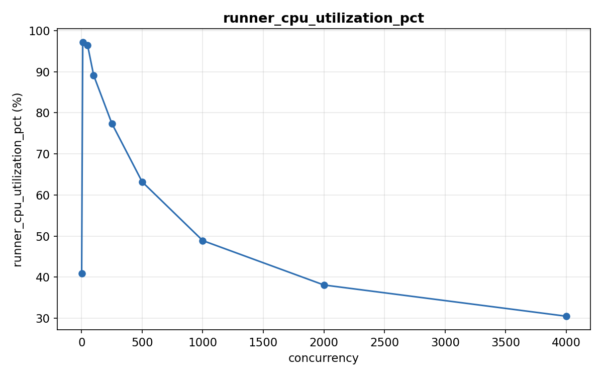

# Redis에 요청을 얼마나 넣으면 터질까?

- 날짜: 2026-07-15
- 템플릿: redis-blocking-threshold
- 태그: redis, performance, docker

## 안건
Redis에 요청을 얼마나 넣으면 죽을까?

## 가설
Redis는 단일 스레드 이벤트 루프이므로, concurrency가 baseline(최소 concurrency)
대비 P99 10배 임계값을 넘는 지점부터 이벤트 루프가 포화되어 처리량은 정체되고
지연시간이 급증할 것이다.

## 요약
- 동시 연결 250개부터 심상치 않다.
- concurrency(동시 요청) 1일 때 SET P99(요청 99%가 처리되는 시간 — 사실상
  최악에 가까운 케이스)는 0.087ms인데, 250에서 1.271ms로 약 14.6배 뛴다.
- 근데 가설과 실제는 달랐다.
- redis-server CPU 사용률은 이 구간 내내 6~17%로 낮았다.
- 대신 부하를 쏘는 클라이언트(runner) 컨테이너가 concurrency 10~50에서 CPU를
  거의 다 썼다(96~97%) — 병목은 서버가 아니라 클라이언트 쪽이었다.

## 구성
- `redis:7-alpine`, `--maxmemory-policy noeviction`, `cpus: 2` 제한 (docker compose)
- `runner`: 공용 이미지(`ds-labs/runner:1.0.0`)를 `redis-tools`로 확장
- 부하 도구: Debian `redis-tools` 패키지의 `redis-benchmark`
- 부하 조건: concurrency `[1, 10, 50, 100, 250, 500, 1000, 2000, 4000]` 9단계 스윕,
  스텝당 SET/GET 각 100,000 요청, 각 스텝 3회 반복 후 중앙값 사용
- 계측 대상: redis-server(CPU·명령 처리 시간) + runner 컨테이너 자체(CPU) 동시 계측
- 실행 환경(컨테이너 내부 관측치): `aarch64`, 2 core, 3.8GB

## 방법

1. 스펙대로 Redis를 띄운다.
   ```
   docker compose -f templates/redis-blocking-threshold/docker-compose.yml up -d redis
   ```

2. concurrency를 1부터 4000까지 9단계로 올려가며 SET/GET을 순서대로 때린다 —
   노이즈와 실제 신호를 가르려고 각 단계를 3번씩 반복해 중앙값을 쓴다.
   ```
   redis-benchmark -h redis -t set,get -n 100000 -c <concurrency> --csv
   ```

3. "느려진 게 진짜 서버가 바빠서인가, 아니면 부하를 쏘는 쪽이 바빠서인가?"를
   직접 확인하려고, 반복마다 redis-server와 runner 컨테이너 자체 계측을 같이 찍는다.
   ```
   redis-cli -h redis CONFIG RESETSTAT
   redis-cli -h redis INFO cpu           # used_cpu_user 델타 → 서버 CPU 사용률
   redis-cli -h redis INFO commandstats  # usec_per_call → 명령 하나 처리 시간
   cat /proc/stat | grep '^cpu '         # runner 컨테이너 자체의 CPU 사용률
   ```
   클라이언트가 보는 P99, 서버가 실제로 쓴 처리 시간, 클라이언트(runner) 자신의
   CPU 사용률 — 이 세 가지를 나란히 놓고 비교하는 게 핵심이다.

4. 스윕이 끝나면 raw CSV를 `results.json`으로 조립하고(반복 3회의 중앙값 계산
   포함) 스키마 검증 → 차트 생성까지 한 번에 돌린다.
   ```
   docker compose -f templates/redis-blocking-threshold/docker-compose.yml run --rm runner \
     ./experiment.sh --params params.yml --out results
   ```

## 결과

| concurrency | SET P99 (ms) | GET P99 (ms) | SET 처리량 (ops/sec) | GET 처리량 (ops/sec) |
|---|---|---|---|---|
| 1    | 0.087  | 0.087  | 23,793  | 22,826  |
| 10   | 0.095  | 0.095  | 191,571 | 199,601 |
| 50   | 0.567  | 0.591  | 183,486 | 183,824 |
| 100  | 0.567  | 0.543  | 176,367 | 175,439 |
| **250**  | **1.271**  | 1.183  | 156,006 | 159,236 |
| 500  | 3.887  | 2.879  | 146,628 | 147,929 |
| 1000 | 7.999  | 8.327  | 136,612 | 137,741 |
| 2000 | 13.047 | 9.887  | 133,869 | 131,926 |
| 4000 | 32.351 | 38.367 | 125,471 | 133,869 |

(값은 스텝당 3회 반복의 중앙값. 반복별 범위는 [`results/results.json`](results/results.json)의
`note` 필드 참고.)

## 발견 사항 및 분석

### 성능 및 일반적인 사례
baseline(기준값 — 여기선 `concurrency=1`일 때 수치)의 SET P99는 0.087ms.

`250`에서 1.271ms — 약 14.6배로 "baseline 10배" 선을 처음 넘는다
(`summary.blocking_threshold_concurrency = 250`).

처리량은 `10` 구간에서 정점(SET 191,571 ops/sec, GET 199,601 ops/sec) 찍고
그 뒤로는 완만히 내려간다. P99는 `250`부터 눈에 띄게 오르기 시작해서 `4000`에서는
SET 32ms, GET 38ms까지 뛴다.


SET/GET 순서는 구간마다 다르다 — `250`에서는 SET이 더 나쁘고(1.271 vs 1.183ms),
`2000`에서도 SET이 더 나쁘고(13.047 vs 9.887ms), `4000`에서는 반대로 GET이 더
나쁘다(38.367 vs 32.351ms).

지난 번(단일 샘플) 실행에서는 "SET이 항상 GET보다 나쁘다"는 꽤 깔끔한 그림이
나왔었다. 이번에 3번씩 돌려보니 그 순서 자체가 재현되지 않는다 — 그때 봤던
패턴은 노이즈였다는 뜻이다. 한 번 돌리고 나온 순서를 결론으로 못 박지 않길
잘했다.

### 추가로 알면 좋을 사항
여기서부터가 진짜다 — redis-server는 이 구간 내내 안 바빴는데(6~17%), 부하를
쏘는 runner 컨테이너는 완전히 다른 얘기였다.

| concurrency | redis-server CPU | runner(클라이언트) CPU | SET usec_per_call | GET usec_per_call |
|---|---|---|---|---|
| 1    | 6.2%  | 40.9% | 0.61 | 0.51 |
| 10   | 17.0% | 97.1% | 0.31 | 0.26 |
| 50   | 14.7% | 96.4% | 0.32 | 0.27 |
| 100  | 13.8% | 89.1% | 0.35 | 0.30 |
| 250  | 10.0% | 77.4% | 0.38 | 0.32 |
| 500  | 9.3%  | 63.2% | 0.42 | 0.36 |
| 1000 | 6.3%  | 48.9% | 0.43 | 0.39 |
| 2000 | 3.8%  | 38.1% | 0.47 | 0.42 |
| 4000 | 3.4%  | 30.5% | 0.52 | 0.45 |




`10`~`50` 구간에서 runner CPU 사용률이 96~97%까지 치솟는다 — 사실상 포화
상태다. 같은 구간에서 redis-server CPU는 14~17%에 그친다. 이 구간의 병목은
서버가 아니라 부하를 만들어내는 클라이언트 쪽이었다는 뜻이다.

그런데 이것만으로 전체 그림이 설명되진 않는다. concurrency가 `250`에서
`4000`으로 올라갈수록 runner CPU는 오히려 떨어진다(77% → 31%). 근데 그 구간
내내 P99는 계속 오른다.

CPU를 덜 쓰면서 더 오래 걸린다는 건, 클라이언트가 "일하는" 시간이 아니라
"기다리는" 시간이 늘고 있다는 신호다 — 연결이 쌓이고 큐잉되는 쪽에 더 가까운
증거다. `usec_per_call`(서버가 명령 하나 처리하는 데 쓴 시간)도 0.26~0.61usec
사이에서 큰 변화 없이 낮게 유지됐다 — 서버 쪽 처리 비용이 원인이 아니라는
기존 결론을 다시 한번 뒷받침한다.

즉 낮은~중간 concurrency에서는 클라이언트 CPU 포화가, 높은 concurrency에서는
뭔가 다른 것(아마 연결 레벨 큐잉)이 각각 다른 구간을 설명하는 걸로 보인다 —
하나의 원인으로 깔끔하게 안 떨어진다.

## 결론

- **가설 중 맞은 부분**: concurrency 250부터 P99가 baseline 10배를 넘고,
  그 뒤로도 계속 커질수록 더 크게 뛴다.
- **가설 중 틀린 부분**: "이벤트 루프가 CPU 포화돼서 그렇다"는 핵심 설명은
  데이터가 반박한다. redis-server CPU 사용률은 이 구간 내내 6~17%에 그쳤다 —
  서버는 "바빠서" 못 받아준 게 아니다.
- **새로 알아낸 것**: 대신 부하를 쏘는 클라이언트(runner)가 concurrency
  10~50에서 CPU를 거의 다 썼다(96~97%) — 저~중간 concurrency 구간의 병목은
  서버가 아니라 클라이언트였다.
- **아직 모르는 것**: concurrency가 더 올라가면(250→4000) 클라이언트 CPU
  사용률은 오히려 떨어지는데 P99는 계속 오른다 — 이 구간은 클라이언트 CPU
  포화로도 설명이 안 된다. 연결 레벨 큐잉이 유력한 후보지만 이번 실험
  범위 밖이라 단정하지 않고 다음 연구 과제로 넘긴다.

## 연관 연구 주제 제안

- 높은 concurrency(250 이상)에서 클라이언트 CPU는 떨어지는데 P99는 계속
  오르는 이유는 뭘까? 연결 레벨 큐잉(TCP accept backlog, 연결 수 자체)이
  유력한 후보다 — 클라이언트가 "일하는" 대신 "기다리는" 시간이 늘어난다는
  증거를 더 모아야 한다.
- concurrency 10~50에서 클라이언트가 이미 포화 상태였다면, redis-benchmark
  대신 더 가벼운/멀티스레드 부하 도구를 썼을 때 같은 임계점이 그대로 나올까,
  아니면 임계점 자체가 부하 도구 성능에 좌우되는 걸까?
- 코어를 1개에서 8개로 늘리면 단일 스레드 Redis와 멀티스레드 Memcached는
  얼마나 다르게 스케일링될까?
- 메모리가 커질수록 BGSAVE의 Copy-on-Write가 만드는 레이턴시 스파이크는
  얼마나 커질까?
